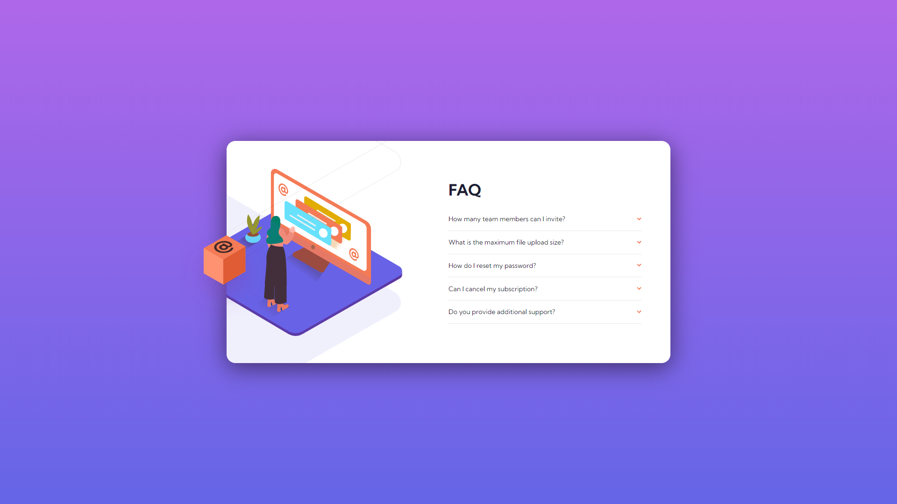

# Frontend Mentor - FAQ accordion card solution

This is a solution to the [FAQ accordion card challenge on Frontend Mentor](https://www.frontendmentor.io/challenges/faq-accordion-card-XlyjD0Oam).

## Table of contents

- [Overview](#overview)
  - [The challenge](#the-challenge)
  - [Screenshot](#screenshot)
  - [Links](#links)
- [My process](#my-process)
  - [Built with](#built-with)
  - [What I learned](#what-i-learned)
  - [Continued development](#continued-development)
  - [Useful resources](#useful-resources)

## Overview

### The challenge

Your task is to build out the project to the designs inside the `/design` folder. You will find both a mobile and a desktop version of the design. 

The designs are in JPG static format. Using JPGs will mean that you'll need to use your best judgment for styles such as `font-size`, `padding` and `margin`. 

Users should be able to:

- View the optimal layout for the component depending on their device's screen size
- See hover states for all interactive elements on the page
- Hide/Show the answer to a question when the question is clicked

### Screenshot

I've included 4 screenshots in the `/screenshots` folder: mobile, tablet, desktop, and fullscreen.

### Links

I'll update these links once I've submitted my solution. 

- Solution URL: [Add solution URL here](https://your-solution-url.com)
- Live Site URL: [Add live site URL here](https://your-live-site-url.com)

## My process

I started with the HTML while observing the desktop version then wrote the CSS for the mobile version
and expanded from there. 

This challenge was really tricky because not only weren't the images provided not centered, one was 
split into two different parts I had to piece together using `position: absolute`. 

I avoid using this property as much as I can because things can break very easily, but for this instance, 
I felt like I had no choice. The positions of some the images was so precise things like flexbox and grid
wouldn't have helped me much. 

All in all, this challenge was a bit of a pain to complete, and I had to resort to using some hacks 
due to the nature of the images given to me. 

Not my finest work, but I learned a ton I'll include in the ["What I Learned"](#what-i-learned)
section below. 

### Built with

- Semantic HTML5 markup
- CSS custom properties
- Flexbox
- Mobile-first workflow

### What I learned

I originally used an `` tag to store the background images, but as the layout changed, these went
out of the container. My initially thought was to figure out how to snip off a section of the illustration
to look like the design, which led to me learning aboout the `clip-path` property for the first time.

It seems like a helpful property that could come in handy at some point, but I doubt it's something that'll come into play often. Most images are normally already the way you want them by the time you're 
writing the code. Still, if the need arises, I now know about its existence. 

Similarly, I learned about the `background-clip` property that determines how the background image
clips this time. You can set it to `border-box` (default), `padding-box`, or `content-box`. 

In reading about background images, I learned a bit more about the `background-position` property (of
which, I believe, I abused in one of the media queries, but that's a story for another day :)) as well.

I also used the `<picture>` element to solve the art direction problem. I'm glad I got to practice with that a bit. 

This is my first accordion, so the experience in making it is quite beneficial going forward. 

Finally, I learned that you can style multiple background images using comma separated values. I knew
about having multiple images, but now that I know you can also style them separately, I'm a little more
confident about using background images. 

### Continued development

I gave myself a window for when this challenge should've been completed I overshot a little bit. Most of it is due to the fact that this is the first accordion I've made, so some reading was necessary.

Furthermore, the issues with the centering of the original images cost me a lot of time I didn't think
I would end up wasting before figuring out my code wasn't exactly the cause of the issues I was having. 

Still, timing is something I'll keep working on. Hoping to get these "simpler" challenges done in about 4 to 6 hours for now then improving from there. 

I'm also hoping to do more accordions in future with more animations e.g. the arrow rotating up, and the 
information box sliding down. I'd spent too much time on this challenge already by the time I opted to
submit it I felt adding more complexity was not the best move.

Speaking of which, animation in general is something I'd like to work on in future, God-willing. 

I'm aware of the performance hit that comes with attaching many event listeners in `main.js`, but for this
scenario, I didn't worry too much about it. The FAQs aren't that many, so it's not a major concern.

However, I know that the better approach would be to attach one event listener to the container housing
the FAQs then query the DOM for the one that's clicked. I just went with my initial approach for the sake
of time and simplicity. 

### Useful resources

- [clip-path property](https://www.w3schools.com/cssref/css3_pr_clip-path.asp) - Article to the `clip-path` property. Interesting bit of information on clipping images.
- [background-clip property](https://www.w3schools.com/cssref/css3_pr_background-clip.asp) - `background-clip` property article.
- [Centrally positioning an absolutely positioned element](https://stackoverflow.com/questions/7720730/how-to-align-absolutely-positioned-element-to-center) - A good answer I found on StackOverflow on how to centrally align absolutely positioned elements. I initially was going to use this but decided to go with
a different approach. Still, it gave me some valuable information on how to go about things. 
